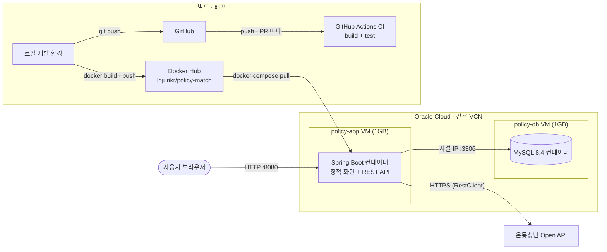

# 청년정책 매칭 서비스

[](https://github.com/lhjunkr/public-data-site/actions/workflows/ci.yml)

나이 · 시도 · 소득을 입력하면 조건에 맞는 청년 지원 정책 후보를 좁혀 주는 서비스입니다.
데이터는 온통청년(한국고용정보원) Open API에서 수집합니다.

**공개 URL** — http://161.33.139.178:8080/

> 이 서비스는 자격을 판정하지 않습니다. 후보를 좁혀 줄 뿐이며, 최종 자격은 각 정책의 신청처에서 확인해야 합니다.

## 주요 기능

- **정책 매칭** — 나이 · 시도 · 연소득 3가지 조건으로 정책을 걸러 조회수 순으로 보여 줍니다. 신청 기간이 끝난 정책은 결과에서 빠집니다.
- **소득 조건 3가지 상태** — 정책마다 `충족` / `미충족` / `판단불가`를 표시합니다. 소득 조건이 숫자가 아니라 글로만 적힌 정책은 `판단불가`로 남기고 원문을 그대로 보여 줍니다.
- **추가 자격 확인 필요 표시** — 자유 서술로 된 추가 자격 조건이 있는 정책에는 "추가 자격 확인 필요" 뱃지를 붙입니다.
- **데이터 수집 · 정규화** — 온통청년 API를 페이지 단위로 전량 수집해 원본 JSON을 그대로 저장하고(10/1 기준 3,106건), 그중 금융 · 주거 분야 30건을 골라 매칭용 표로 옮깁니다. 두 작업 모두 다시 실행해도 중복이 생기지 않습니다.

## 아키텍처



- **앱 서버와 DB 서버를 분리했습니다.** 무료 티어 1GB 인스턴스 한 대에 Spring과 MySQL을 함께 올리면 메모리 여유가 0이 되고, 한쪽 부하가 다른 쪽을 죽이기 때문입니다.
- **DB는 인터넷에 열지 않습니다.** 3306 포트는 VCN 내부 대역(`10.0.0.0/16`)에서만 허용하고, 앱은 사설 IP로 접속합니다.
- **서버에서 빌드하지 않습니다.** 1GB 메모리로는 Gradle 빌드가 돌지 않아, 로컬에서 이미지를 만들어 Docker Hub를 거쳐 서버가 내려받습니다.

### 데이터 흐름

```
온통청년 API ──수집──▶ policy_raw (원본 JSON 전량)
                          │
                        정규화 (승인된 정책 · 설정한 분류 · 30건)
                          ▼
              policy / policy_region / policy_job
                          │
                        매칭 SQL (나이 · 시도 · 소득)
                          ▼
              POST /api/v1/policies/match 응답
```

## 기술 스택

| 구분 | 사용 기술 |
|---|---|
| 언어 · 프레임워크 | Java 21, Spring Boot 4.1 |
| 데이터 | MySQL 8.4, Flyway, Spring Data JPA, NamedParameterJdbcTemplate (매칭 SQL) |
| 외부 연동 | RestClient (온통청년 Open API) |
| 화면 | 정적 HTML + `fetch` (`src/main/resources/static/index.html`) |
| 테스트 | JUnit 5 — 매칭 경계값 · 입력 검증 · API 통합 (18개) |
| 배포 | Docker (멀티스테이지), Docker Compose, Oracle Cloud VM 2대 |
| CI | GitHub Actions (MySQL 서비스 컨테이너 기반 build + test) |

## API

| 메서드 | 경로 | 설명 |
|---|---|---|
| `GET` | `/health` | 상태 확인 |
| `GET` | `/api/v1/regions/sido` | 시도 코드 · 이름 목록 |
| `POST` | `/api/v1/policies/match` | 조건에 맞는 정책 매칭 |
| `GET` | `/api/v1/policies` | 정규화된 정책 전체 목록 |
| `POST` | `/api/v1/admin/collect` | 원본 수집 배치 (`X-Admin-Token` 필요) |
| `POST` | `/api/v1/admin/normalize` | 정규화 배치 (`X-Admin-Token` 필요) |

매칭 요청 예시:

```bash
curl -X POST http://161.33.139.178:8080/api/v1/policies/match \
  -H "Content-Type: application/json" \
  -d '{"age": 25, "sido": "11", "income": 3000}'
```

| 필드 | 필수 | 설명 |
|---|---|---|
| `age` | 필수 | 나이 (0~120) |
| `sido` | 필수 | 시도 코드 2자리. 예: `"11"` 서울 |
| `income` | 선택 | 연소득(만원). 비우면 금액 비교가 필요한 정책은 `UNKNOWN`으로 나옵니다 |

응답 형태:

```json
{
  "count": 1,
  "policies": [
    {
      "id": 1,
      "title": "…",
      "categoryLarge": "…",
      "categoryMedium": "…",
      "supportContent": "…",
      "applyPeriodText": "…",
      "applyUrl": "…",
      "refUrl": "…",
      "incomeStatus": "MET",
      "incomeNote": null,
      "needsCheck": true
    }
  ]
}
```

`incomeStatus`는 `MET`(충족) / `NOT_MET`(미충족) / `UNKNOWN`(판단불가) 중 하나입니다.
입력이 잘못되면(나이 누락, 없는 시도 코드 등) `400`을 돌려줍니다.

## 로컬 실행

준비물: JDK 21, Docker, 온통청년 Open API 인증키

```bash
git clone https://github.com/lhjunkr/public-data-site.git
cd public-data-site
cp .env.example .env
docker compose up -d
./gradlew bootRun
```

`.env`에 채울 값:

| 이름 | 설명 |
|---|---|
| `MYSQL_ROOT_PASSWORD` · `MYSQL_DATABASE` · `MYSQL_USER` · `MYSQL_PASSWORD` | 로컬 MySQL 컨테이너 설정 |
| `YOUTH_API_KEY` | 온통청년 Open API 인증키 |
| `ADMIN_TOKEN` | 수집 · 정규화 엔드포인트를 보호하는 임의의 문자열 |

앱이 뜨면 Flyway가 표를 자동으로 만듭니다. 처음에는 데이터가 비어 있으므로 수집과 정규화를 한 번씩 실행합니다.

```bash
curl -X POST http://localhost:8080/api/v1/admin/collect -H "X-Admin-Token: <ADMIN_TOKEN 값>"
curl -X POST http://localhost:8080/api/v1/admin/normalize -H "X-Admin-Token: <ADMIN_TOKEN 값>"
```

이후 http://localhost:8080/ 에서 화면을 확인합니다.

테스트 실행 (실제 MySQL을 쓰므로 `docker compose up -d` 상태에서):

```bash
./gradlew test
```

## 배포

서버용 설정은 [`deploy/app`](deploy/app)과 [`deploy/db`](deploy/db)에 있습니다. 각 폴더의 `.env.example`은 필요한 변수의 이름만 담고 있고, 실제 값은 서버의 `.env`에만 둡니다.

```bash
docker build --platform linux/amd64 -t lhjunkr/policy-match:<태그> .
docker push lhjunkr/policy-match:<태그>
```

이후 앱 서버에서 `docker-compose.yml`의 이미지 태그를 바꾸고 다음을 실행합니다.

```bash
docker compose pull
docker compose up -d
```

## 설계 결정 요약

전체 목록과 근거는 [`docs/decisions.md`](docs/decisions.md)에 있습니다.

| 결정 | 이유 |
|---|---|
| 자격을 "판정"하지 않고 후보를 "좁히는 필터"로 정의 (D-001) | 자격 조건 일부가 자유 서술이라 기계가 확정할 수 없다 |
| 소득 결과를 충족 / 미충족 / 판단불가 3가지로 반환 (D-002, D-006) | 소득 조건의 9%가 숫자 없이 글로만 적혀 있다. 구분 코드로 분기하고, 비교할 수 없으면 판단불가로 남긴다 |
| 자유 서술 필드는 해석하지 않고 "확인 필요"로 표시 (D-003) | 자연어 해석은 오판 위험이 크다. 틀린 안내보다 확인을 요청하는 편이 안전하다 |
| 지역 · 취업상태 같은 다중값은 콤마 문자열이 아니라 조인 테이블로 저장 ([ADR-001](docs/adr/ADR-001.md)) | 정확히 일치하는 검색에 인덱스를 쓸 수 있고, 집계가 가능하며, 외래 키로 잘못된 코드를 막는다 |
| API 원본을 `policy_raw`에 그대로 보관하고, 마감된 정책도 지우지 않고 조회할 때 제외 (D-008) | 재수집 없이 다시 정규화할 수 있고, 배치를 다시 돌려도 결과가 같다(멱등성) |
| 취업 상태 조건은 보류, 현재 매칭은 3축 (D-012) | 취업 상태 코드의 뜻이 명세로 확인된 것이 아니라 추측이다. 추측으로 조건을 걸면 틀린 안내가 나온다 |

## 현재 한계와 다음 계획

| 현재 | 다음 |
|---|---|
| 매칭 대상이 직접 고른 30건 | 규칙(대상 분류 + 신청 가능 여부)으로 고른 전체로 확대 |
| 취업 상태 조건 미반영 | 코드 뜻을 명세로 확인한 뒤 4축 매칭 |
| 배포 · 수집을 수동 실행 | `main` 머지 시 자동 배포(CD), 매일 자동 수집 |
| 지역은 시도 단위로만 매칭 | 시군구 이름 정비 |
| IP 주소 + HTTP | 도메인 + HTTPS |

## 문서

- [`docs/decisions.md`](docs/decisions.md) — 설계 결정 기록 (D-001 ~ D-012)
- [`docs/adr/ADR-001.md`](docs/adr/ADR-001.md) — 조인 테이블 채택 근거
- [`docs/erd.md`](docs/erd.md) — ERD와 API 필드 매핑
- [`docs/retrospective.md`](docs/retrospective.md) — 9월 회고 (계획과 실제, 틀렸던 것과 원인)

데이터 출처: 온통청년 (한국고용정보원)
