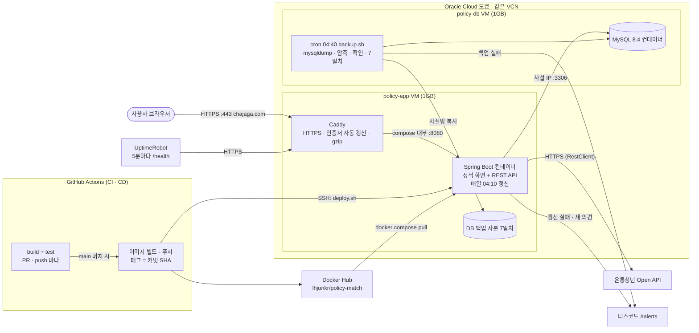

# 청년정책 매칭 서비스

[](https://github.com/lhjunkr/public-data-site/actions/workflows/ci.yml)

**나이 · 사는 지역 · 취업 상태 · 연소득을 넣으면, 수천 건의 청년 지원 정책 가운데 나에게 해당될 수 있는 것만 좁혀 보여 주는 서비스입니다.**

**공개 URL** — https://chajaga.com/

> 이 서비스는 자격을 판정하지 않습니다. 후보를 좁혀 줄 뿐이며, 최종 자격과 지원 내용은 각 정책의 신청처에서 확인해야 합니다.

## 한눈에 보기

**문제** — 청년 지원 정책은 약 4,000건인데, 자격 조건이 정책마다 다른 모양으로 적혀 있습니다. 지역은 시군구 코드 수십 개가 콤마로 이어져 있고, 나이는 "제한 여부" 표시와 실제 값이 어긋나며, 소득은 원 · 만원 단위가 섞이거나 글로만 적혀 있습니다. 그래서 "내가 받을 수 있는 정책"을 알려면 하나씩 열어 읽어야 합니다.

**해결** — 공공 API 원본을 매일 수집해 비교할 수 있는 형태로 정규화하고, 나이 · 시도 · 취업 상태 · 소득으로 한 번에 좁힙니다. 기계가 비교할 수 없는 조건은 빼지 않고 `판단불가` · "추가 자격 확인 필요"로 남깁니다. 원칙은 **판정하지 않고 좁힌다**입니다 — 받을 수 있는 정책을 잘못 빼는 것이 더 나쁘기 때문입니다.

| 숫자 | |
|---|---|
| 정책 | 약 4,000건. 지역 연결 21만 행을 시도 단위 1만 5천 행으로 줄여 매칭 |
| 예: 25세 · 서울 | 476건으로 좁힘 (2026-11-22) |
| 운영 | 2026-09-15 공개 · 매일 04:10 자동 갱신 · 실패 알림 · DB 백업 · `main` 머지 = 자동 배포 |
| 기록 | 설계 결정 D-001 ~ D-027 · 테스트 112개 (실제 MySQL로 경계값 · 정규화 · API 확인) |

### 성능 — 측정으로 병목을 찾아 하나씩 고침 ([D-027](docs/decisions.md), [측정 기록](docs/performance.md))

| 항목 | Before (11/10) | After (11/22) |
|---|---|---|
| 처음 방문 응답 (p50) | 1.17초 | **0.35초** (−70%) |
| 동시 5명 처리량 | 초당 1.37건 | **초당 10.5건** (7.7배) |
| 동시 10명 응답 (중앙값) | 6.9초 | **0.85초** |
| 응답 크기 | 356KB | **28KB** |

처음에는 나이 · 마감일 범위 인덱스가 병목이라고 짐작했지만, 실행 계획을 재 보니 범위 조건은 SQL의 2%였고 **지역 확인이 93%**(정책 × 시군구 코드 57,700번 확인)였습니다. ① 지역을 시도 단위 표로 저장 → ② 목록에서 긴 글을 빼고 상세 조회로 분리 → ③ 응답 압축 순으로 고쳤고, 고칠 때마다 예측을 먼저 적은 뒤 같은 조건으로 다시 쟀습니다.

### 장애 3건 — 로그 저장 → 되돌리기 → 원인 측정 → 수정 → 결정 기록

| 날짜 | 무슨 일 | 원인 | 바꾼 것 |
|---|---|---|---|
| 10/30 | 정규화 직후 **검색 결과 0건** | 참고 URL 542자가 칸(500자)을 넘어 정규화 전체가 되돌려짐 | 이전 버전으로 롤백 → 칸 길이 측정 → URL 칸 2,048자 · 정책 단위로 실패 격리 (D-019) |
| 10/30 | 정상 정책 **30건이 결과에서 빠짐** | 원본 API가 일시 오류에도 `400`을 줘 수집이 9페이지에서 끊긴 상태로 정규화 | `400` 재시도 · "마지막으로 성공한 수집" 기준으로만 정규화 (D-017) |
| 11/1 | 새벽 **자동 갱신 실패** | 31페이지에서 일시적인 `403`, 재시도 없이 포기 | 화면은 전날 데이터로 계속 서비스(설계대로) · `403`도 재시도 (D-022) · 실패 알림 (D-026) |

---

## 해결하려는 문제

청년 지원 정책은 많습니다. 정부 청년정책 플랫폼 온통청년에 승인된 정책만 약 **4,000건**입니다(2026-11-11 정규화 기준 3,966건). 중앙부처와 지자체 정책이 섞여 있고, 자격 조건은 정책마다 따로 적혀 있습니다. 그래서 "**내가 받을 수 있는 정책이 무엇인지**" 알려면 정책을 하나씩 열어 조건을 읽어야 합니다.

조건을 컴퓨터로 걸러 주면 될 것 같지만, 원본 데이터의 조건은 바로 비교할 수 있는 형태가 아닙니다. 직접 수집해 측정한 결과입니다.

| 조건 | 원본 데이터의 실제 모습 (측정) |
|---|---|
| 지역 | 정책 하나에 시군구 코드가 콤마로 이어져 있습니다. 정책당 평균 **55개**, 많게는 전국 시군구 전체입니다 (3,763건 → 지역 연결 207,475행) |
| 나이 | "나이 제한 여부" 표시와 실제 나이 값이 어긋납니다. 742건 중 172건에서 표시와 값이 맞지 않고, `0`은 "경계 없음"이라는 뜻입니다 |
| 소득 | 금액이 원 단위와 만원 단위로 섞여 있습니다. 742건 중 35.7%는 기준이 글로만 적혀 있거나 비어 있어 숫자로 비교할 수 없습니다 |
| 취업 상태 | 코드 10개가 콤마로 붙어 있습니다. 뜻은 공식 코드표를 봐야 알 수 있고, 74%는 "제한없음"입니다 |
| 분야 | 대분류 이름이 옛 체계와 새 체계 두 세대로 섞여 있고, 이름이 바뀐 중분류도 있습니다 |
| 원본 API | 정상 키로도 가끔 `400` · `403`을 돌려줍니다. 수집이 중간에 끊긴 상태로 정리 작업을 돌려, 정상 정책 30건이 결과에서 빠진 적이 있습니다 (2026-10-30, 복구) |

나이 · 소득 수치는 2026-10-30에 주거 · 금융 분야 742건을 측정한 값이고, 나머지는 전체 정책을 잰 값입니다. 측정 방법과 원문 대조는 [`docs/quality-check.md`](docs/quality-check.md)에 있습니다.

## 이 프로젝트가 하는 일

| 문제 | 해결 | 결정 기록 |
|---|---|---|
| 조건을 하나씩 확인해야 한다 | 나이 · 시도(필수), 취업 상태 · 연소득(선택)으로 한 번에 좁힙니다. 예: 25세 · 서울 → **476건** (2026-11-22) | D-001, D-021 |
| 지역이 콤마 다중값이다 | 연결 표(`policy_region`)로 쪼개 저장하고, 매칭은 시도 단위로 줄인 표(`policy_sido`)에서 `EXISTS`로 찾습니다 | [ADR-001](docs/adr/ADR-001.md), D-027 |
| 나이 표시와 값이 어긋난다 | 표시는 보지 않고 값만 봅니다. `0`은 경계 없음, 뒤집힌 값은 결과에 포함합니다 | D-015 |
| 소득 단위가 섞이고 글로만 적힌 기준이 있다 | 만원으로 통일합니다. 비교할 수 없으면 `충족` / `미충족` 대신 **`판단불가`**로 표시하고 원문을 보여 줍니다 | D-002, D-016 |
| 기계가 판단할 수 없는 추가 조건이 있다 | 해석하지 않고 "추가 자격 확인 필요"로 표시합니다 | D-001, D-003 |
| 취업 상태 코드의 뜻을 모른다 | 공식 코드표로 확인한 뒤에야 조건으로 넣었습니다(그전까지는 보류) | D-012 → D-021 |
| 분류가 뒤섞여 있다 | 실제 분포로 묶음표를 만들어 5개 탭 · 세부 칩으로 나눕니다 | D-018 |
| 정책은 매일 바뀐다 | 매일 04:10 수집 → 성공했을 때만 정규화합니다 | D-020 |
| 원본 API가 불안정하다 | 같은 요청을 다시 시도하고, 수집이 실패한 날은 마지막으로 성공한 데이터를 그대로 보여 주며 디스코드로 알립니다 | D-017, D-022, D-026 |
| 검색이 느렸다 (1.17초, 동시 처리량 초당 1.37건) | 측정으로 병목(지역 확인 93%)을 찾아 시도 단위 표 · 긴 글 분리 · 응답 압축 순으로 고쳤습니다 → 0.35초, 초당 10.5건 | D-027 |

**원칙은 "판정하지 않고 좁힌다"입니다.** 확실히 해당되지 않는 정책만 빼고, 판단할 수 없으면 결과에 남긴 채 확인이 필요하다고 표시합니다. 받을 수 있는 정책을 잘못 빼는 것이 더 나쁘기 때문입니다.

## 화면에서 할 수 있는 것

- 조건을 넣으면 해당될 수 있는 정책을 조회수 순으로 보여 줍니다. 신청 기간이 끝난 정책은 빠집니다.
- 정책마다 소득 조건을 `충족` / `미충족` / `판단불가`로 표시합니다.
- 정책의 **지원 내용 보기**를 펼치면 그때 그 정책의 지원 내용을 불러옵니다(목록에는 긴 글을 싣지 않음).
- 결과를 주거 · 금융·복지 · 교육 · 참여 · 일자리 탭과 세부 칩으로 나눠 봅니다. 결과는 20건씩 펼칩니다.
- 하단에 정책 정보 출처(온통청년 청년정책 Open API)와 정보 기준 시각이 있습니다.
- 오른쪽 위 **의견 보내기**로 결과가 이상한 정책이나 불편한 점을 알릴 수 있습니다. 답장을 원하면 이메일을 남길 수 있고(동의 필요), 이메일은 답장한 뒤 또는 90일이 지나면 지웁니다.

---

## 아키텍처


```mermaid
flowchart LR
    user(["사용자 브라우저"])
    youth["온통청년 Open API"]
    discord["디스코드 #alerts"]
    robot["UptimeRobot<br/>5분마다 /health"]

    subgraph oci ["Oracle Cloud 도쿄 · 같은 VCN"]
        subgraph appvm ["policy-app VM (1GB)"]
            caddy["Caddy<br/>HTTPS · 인증서 자동 갱신 · gzip"]
            app["Spring Boot 컨테이너<br/>정적 화면 + REST API<br/>매일 04:10 갱신"]
            copy[("DB 백업 사본 7일치")]
        end
        subgraph dbvm ["policy-db VM (1GB)"]
            db[("MySQL 8.4 컨테이너")]
            backup["cron 04:40 backup.sh<br/>mysqldump · 압축 · 확인 · 7일치"]
        end
    end

    subgraph delivery ["GitHub Actions (CI · CD)"]
        ci["build + test<br/>PR · push 마다"]
        img["이미지 빌드 · 푸시<br/>태그 = 커밋 SHA"]
    end
    hub["Docker Hub<br/>lhjunkr/policy-match"]

    user -- "HTTPS :443 chajaga.com" --> caddy
    robot -- "HTTPS" --> caddy
    caddy -- "compose 내부 :8080" --> app
    app -- "사설 IP :3306" --> db
    app -- "HTTPS (RestClient)" --> youth
    app -- "갱신 실패 · 새 의견" --> discord
    backup --> db
    backup -- "사설망 복사" --> copy
    backup -- "백업 실패" --> discord
    ci -- "main 머지 시" --> img
    img --> hub
    img -- "SSH: deploy.sh" --> app
    hub -- "docker compose pull" --> app
```

- **앱 서버와 DB 서버를 분리했습니다.** 무료 1GB 서버 한 대에 Spring과 MySQL을 함께 올리면 메모리 여유가 없어지고, 한쪽 부하가 다른 쪽을 멈추게 합니다.
- **외부 입구는 Caddy의 80 · 443뿐입니다.** Caddy가 인증서를 자동으로 발급 · 갱신하고, http는 https로, www는 본 주소로 보냅니다. 앱의 8080은 서버 자신(`127.0.0.1`)에만 열려 있어 Caddy를 거치지 않고는 들어올 수 없습니다 (D-025).
- **DB는 인터넷에 열지 않습니다.** 오라클 보안 목록은 3306을 VCN 내부 대역에서만 허용하고, 컨테이너 포트도 사설 IP에만 묶어 두 겹으로 막습니다 (D-026).
- **알리는 쪽이 둘입니다.** 갱신 · 백업 실패와 새 의견은 앱 · 스크립트가 디스코드로 보내고, 사이트 · DB 장애는 바깥의 UptimeRobot이 `/health`(DB까지 확인, 실패 시 503)로 잡아 이메일로 보냅니다. 앱이 통째로 죽으면 앱은 알릴 수 없기 때문입니다 (D-026).
- **백업은 복구해 봐야 백업입니다.** 매일 DB 서버와 앱 서버에 7일치씩 두고, 사본을 빈 MySQL에 복원해 표별 건수가 운영과 같은지 확인했습니다 (D-026).
- **서버에서 빌드하지 않습니다.** 1GB로는 Gradle 빌드가 돌지 않아, GitHub Actions가 이미지를 만들고 서버는 내려받기만 합니다.

### 데이터 흐름

```
온통청년 API ──수집──▶ policy_raw (원본 JSON 전량, 수집마다 collect_run 에 기록)
                          │
                        정규화 (승인된 정책 전부, 마지막 성공 수집 기준)
                          ▼
              policy / policy_region → policy_sido / policy_job / policy_category
                          │
                        매칭 SQL (나이 · 시도 · 취업 상태 · 소득 · 분야, 긴 글은 읽지 않음)
                          ▼
              POST /api/v1/policies/match (목록)  ·  GET /api/v1/policies/{id} (지원 내용)
```

원본을 그대로 보관하기 때문에 규칙을 바꾸면 다시 수집하지 않고 정규화만 다시 돌리면 됩니다. 수집과 정규화는 몇 번을 다시 돌려도 결과가 같습니다(멱등성).

## 기술 스택

| 구분 | 사용 기술 |
|---|---|
| 언어 · 프레임워크 | Java 21, Spring Boot 4.1 |
| 데이터 | MySQL 8.4, Flyway(V1~V9), JdbcTemplate · NamedParameterJdbcTemplate(조회 · 적재), JPA(스키마 검증) |
| 외부 연동 | RestClient (온통청년 Open API, 타임아웃 · 재시도) |
| 예약 작업 | `@Scheduled` (매일 04:10 갱신, 04:30 이메일 보관 기간 정리) |
| 화면 | 정적 HTML + `fetch` (`src/main/resources/static/index.html`) |
| 테스트 | JUnit 5 · MockMvc, 실제 MySQL로 매칭 경계값 · 정규화 · 수집 · 의견 · 요청 제한 등 112개 |
| 배포 | Docker, Docker Compose, Caddy 2(HTTPS · 응답 압축), Oracle Cloud VM 2대 |
| 운영 | 디스코드 웹훅 알림, UptimeRobot 가동 감시, DB 백업(cron · `mysqldump`, 두 서버 7일치) |
| 측정 | `scripts/measure.sh`(구간별 응답 시간), k6(동시 사용자), `EXPLAIN ANALYZE`, `vmstat` |
| CI · CD | GitHub Actions — PR마다 build + test, `main` 머지 시 이미지 빌드 → 서버 배포 → 공개 URL 확인 |

## API

| 메서드 | 경로 | 설명 |
|---|---|---|
| `GET` | `/health` | 상태 확인 · 실행 중인 버전(커밋 7자리) |
| `GET` | `/api/v1/regions/sido` | 시도 코드 · 이름 목록 |
| `GET` | `/api/v1/job-statuses` | 취업 상태 코드 · 이름 목록 |
| `GET` | `/api/v1/categories` | 분야 탭 · 세부 칩 목록 |
| `GET` | `/api/v1/data-status` | 정책 정보 기준 시각 (마지막으로 성공한 수집의 시작 시각) |
| `POST` | `/api/v1/policies/match` | 조건에 맞는 정책 매칭 (목록, 긴 글 제외) |
| `GET` | `/api/v1/policies/{id}` | 정책 하나의 지원 내용. 같은 IP에서 1분에 30번까지(넘으면 `429`) |
| `POST` | `/api/v1/feedback` | 의견 보내기 (`message` 필수, `email` · `consent` 선택) |
| `POST` | `/api/v1/admin/refresh` | 수집 → 성공하면 정규화. 매일 자동 갱신과 같은 일 (`X-Admin-Token` 필요) |
| `POST` | `/api/v1/admin/collect` · `/normalize` | 수집 · 정규화를 따로 실행 (`X-Admin-Token` 필요) |
| `GET` | `/api/v1/admin/feedback?status=NEW` | 받은 의견 목록, 최근 100건 (`X-Admin-Token` 필요) |
| `POST` | `/api/v1/admin/feedback/{id}/done` | 답장 · 처리 완료 표시, 이메일 삭제 (`X-Admin-Token` 필요) |

매칭 요청 예시:

```bash
curl -X POST https://chajaga.com/api/v1/policies/match \
  -H "Content-Type: application/json" \
  -d '{"age": 25, "sido": "11", "job": "0013003", "income": 3000}'
```

| 필드 | 필수 | 설명 |
|---|---|---|
| `age` | 필수 | 나이 (0~120) |
| `sido` | 필수 | 시도 코드 2자리. 예: `"11"` 서울 |
| `job` | 선택 | 취업 상태 코드. 예: `"0013003"` 미취업자. 비우면 취업 상태로 거르지 않습니다 |
| `income` | 선택 | 연소득(만원). 비우면 금액 기준이 있는 정책은 `UNKNOWN`으로 나옵니다 |

응답 형태:

```json
{
  "count": 1,
  "policies": [
    {
      "id": 1,
      "title": "…",
      "categoryLarge": "…",
      "categoryMedium": "…",
      "applyPeriodText": "…",
      "applyUrl": "…",
      "refUrl": "…",
      "incomeStatus": "MET",
      "incomeNote": null,
      "needsCheck": true,
      "categories": ["housing.rent"]
    }
  ]
}
```

`incomeStatus`는 `MET`(충족) / `NOT_MET`(미충족) / `UNKNOWN`(판단불가) 중 하나입니다. `categories`는 세부 칩 코드(`탭.칩`)이고, 이름은 `GET /api/v1/categories`에서 얻습니다. 입력이 잘못되면(나이 누락, 없는 시도 · 취업 상태 코드 등) `400`과 사유를 돌려줍니다.

지원 내용 같은 긴 글은 목록에 싣지 않습니다(응답의 54%였음, D-027). 화면에서 펼칠 때 `GET /api/v1/policies/{id}`로 하나씩 받습니다.

```json
{ "id": 240, "title": "…", "supportContent": "…" }
```

없거나 비활성인 정책은 `404`, id가 숫자가 아니면 `400`입니다. 상세 조회는 정책을 하나씩 내주는 입구라, id를 차례로 불러 전체를 통째로 가져가지 못하게 IP마다 요청 수를 제한합니다(D-023).

## 로컬 실행

준비물: JDK 21, Docker, 온통청년 Open API 인증키

```bash
git clone https://github.com/lhjunkr/public-data-site.git
cd public-data-site
cp .env.example .env
docker compose up -d
./gradlew bootRun
```

`.env`에 채울 값:

| 이름 | 설명 |
|---|---|
| `MYSQL_ROOT_PASSWORD` · `MYSQL_DATABASE` · `MYSQL_USER` · `MYSQL_PASSWORD` | 로컬 MySQL 컨테이너 설정 |
| `YOUTH_API_KEY` | 온통청년 Open API 인증키 |
| `ADMIN_TOKEN` | 관리용 엔드포인트(수집 · 정규화 · 의견 관리)를 보호하는 임의의 문자열 |

앱이 뜨면 Flyway가 표를 만듭니다. 처음에는 데이터가 비어 있으므로 갱신을 한 번 실행합니다. 이후에는 매일 04:10에 자동으로 돕니다.

```bash
curl -X POST http://localhost:8080/api/v1/admin/refresh -H "X-Admin-Token: <ADMIN_TOKEN 값>"
```

테스트 (실제 MySQL을 쓰므로 `docker compose up -d` 상태에서):

```bash
./gradlew test
```

## 배포

`main`에 머지되면 자동으로 배포됩니다 (D-013).

1. GitHub Actions가 build + test를 돌립니다.
2. 통과하면 이미지를 만들어 `lhjunkr/policy-match:<커밋 7자리>`로 Docker Hub에 올립니다.
3. SSH로 앱 서버의 [`deploy.sh`](deploy/app/deploy.sh)를 실행합니다. 새 이미지를 내려받아 다시 띄우고 `/health`를 확인합니다.
4. 공개 URL의 `/health` 버전이 방금 커밋인지 확인합니다.

문제가 생기면 앱 서버에서 이전 커밋으로 되돌립니다.

```bash
./deploy.sh <이전 커밋 7자리>
```

앱이 한 대라 배포 · 재시작마다 수십 초 동안 Caddy가 `502`를 냅니다.

Caddy 설정([`deploy/app/Caddyfile`](deploy/app/Caddyfile))은 자동 배포 대상이 아닙니다. 바꾸면 앱 서버의 `~/policy/Caddyfile`에 복사한 뒤 다시 읽힙니다(연결을 끊지 않음).

```bash
docker compose exec caddy caddy reload --config /etc/caddy/Caddyfile --adapter caddyfile
```

서버용 설정은 [`deploy/app`](deploy/app)과 [`deploy/db`](deploy/db)에 있습니다. `.env.example`에는 변수 이름만 있고, 실제 값은 서버의 `.env`와 GitHub Secrets에만 둡니다.

## 그 밖의 설계 결정

전체 목록과 근거는 [`docs/decisions.md`](docs/decisions.md)에 있습니다.

| 결정 | 이유 |
|---|---|
| 원본을 `policy_raw`에 그대로 보관하고, 마감된 정책도 지우지 않고 조회할 때 제외 (D-008) | 다시 수집하지 않고 규칙만 바꿔 다시 정규화할 수 있다 |
| 정규화는 정책 단위로 실패를 격리하되, 실패가 많으면 전체를 되돌림 (D-019) | 값 하나 때문에 3,000여 건 전체가 실패한 사고(10/30)를 막고, 구조적 문제는 공개되지 않게 한다 |
| 수집 · 정규화는 한 번에 하나만 (D-020) | 정규화 한 번(약 70초)이 MySQL 잠금 대기 한도(50초)보다 길어, 겹치면 뒤의 것이 실패한다 |
| 온통청년 데이터는 비영리로만 쓰고 출처를 표시, 전체 목록 API는 두지 않음 (D-023) | 약관은 사전 승낙 없는 제3자 제공과 동의 없는 상업적 이용을 금지한다. 검색 결과만 보여 준다 |
| 의견 창의 이메일은 동의받은 경우만 받고 답장 후 또는 90일 뒤 삭제. 요청 제한용 IP는 메모리에만 잠깐(의견 10분 · 상세 1분) 두고 저장하지 않음. 디스코드 알림에는 의견 본문 · 이메일을 넣지 않음 (D-024, D-026) | 개인정보는 필요한 만큼만 받고 목적이 끝나면 지운다. 단, 지운 이메일도 DB 백업 파일에는 최대 7일 남는다 |
| 도메인 + Caddy로 HTTPS, 앱 8080은 외부에 닫음 (D-025) | 나이 · 소득 · 이메일이 평문으로 오가던 것을 막고, 암호화 없이 앱에 바로 들어오는 우회 경로를 없앤다 |
| 알림(디스코드) · 감시(UptimeRobot) · 백업(매일, 두 서버 7일치) (D-026) | 11/1 갱신 실패를 로그를 직접 열어 보고서야 알았다. 백업은 복원 연습으로 확인했다 |
| 성능은 측정으로 찾은 병목부터 하나씩 고치고, 고치기 전에 예측을 적는다 (D-027) | 짐작한 병목(범위 인덱스)은 SQL의 2%였다. 예측과 실측의 차이로 계산의 틀린 곳(고정 몫 · 전송 모델)도 찾았다 |

## 현재 한계와 다음 계획

| 현재 | 다음 |
|---|---|
| 학력 · 전공 · 특화 조건(중소기업 · 기초생활수급자 등)은 아직 거르지 않음 | 공식 코드표에 있으므로 같은 방식(측정 → 규칙)으로 검토 |
| 지역은 시도 단위로만 매칭 | 시군구 단위 (원본은 `policy_raw`에 있어 다시 만들 수 있음) |
| 결과가 조회수 순이라 새 정책 · 마감이 임박한 정책이 뒤로 밀림 | 마감 임박순 등 정렬 선택 |
| 동시 처리량이 초당 약 10.5건에서 DB 서버 CPU(1/8 OCPU, 꽉 차면 75%를 클라우드가 가져감)에 막힘 | 초당 5건 미만이 되거나 정책이 2배가 되면 다시 검토 (D-027): 요청당 쿼리 3개 줄이기 · 서버 변경 |
| 앱이 한 대라 배포 · 재시작마다 수십 초 `502` | 사용자가 생기면 두 대를 번갈아 바꾸는 무중단 배포 |
| 장애 알림(UptimeRobot 이메일)과 운영 알림(디스코드) 통로가 나뉨 | 한 곳으로 합치기 |
| 시도 표로 옮기는 중이라 시군구 연결 표(`policy_region`)를 함께 유지 | 롤백할 일이 없다고 확인되면 삭제 (D-027) |

## 문서

- [`docs/decisions.md`](docs/decisions.md) — 설계 결정 기록 (D-001 ~ D-027)
- [`docs/performance.md`](docs/performance.md) — 성능 측정 · 원인 분석 · 개선 전후 (Before → ③, 예측과 실측)
- [`docs/quality-check.md`](docs/quality-check.md) — 데이터 품질 측정, 원문 대조, 사건 기록
- [`docs/adr/ADR-001.md`](docs/adr/ADR-001.md) — 다중값을 연결 표로 저장한 근거
- [`docs/erd.md`](docs/erd.md) — ERD와 API 필드 매핑
- [`docs/retrospective.md`](docs/retrospective.md) — 회고 (계획과 실제, 틀렸던 것과 원인)

정책 정보 출처: 온통청년 청년정책 Open API (국무조정실 · 한국고용정보원)
