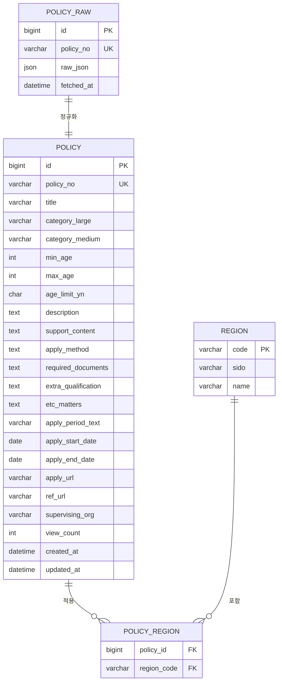

# ERD — 청년정책 매칭 서비스

## 다이어그램



## 표 역할

| 표 | 역할 |
|---|---|
| `policy_raw` | API 응답 원본 JSON을 손실 없이 보관. 재수집 없이 복구·재정규화하기 위함 |
| `policy` | 서비스가 실제로 쓰는 정제 데이터. 필터용 열과 표시용 열이 함께 있음 |
| `region` | 법정동 코드↔이름 사전이자 시군구→시도 계층표 |
| `policy_region` | 정책과 지역의 N:M 관계를 행으로 분해한 연결 표 |

## 필드 매핑 (API → policy)

| API 필드 | 표 열 |
|---|---|
| `plcyNo` | `policy_no` |
| `plcyNm` | `title` |
| `lclsfNm` | `category_large` |
| `mclsfNm` | `category_medium` |
| `sprtTrgtMinAge` | `min_age` |
| `sprtTrgtMaxAge` | `max_age` |
| `sprtTrgtAgeLmtYn` | `age_limit_yn` |
| `plcyExplnCn` | `description` |
| `plcySprtCn` | `support_content` |
| `plcyAplyMthdCn` | `apply_method` |
| `sbmsnDcmntCn` | `required_documents` |
| `addAplyQlfcCndCn` | `extra_qualification` |
| `etcMttrCn` | `etc_matters` |
| `aplyYmd` | `apply_period_text` (원문) → `apply_start_date` / `apply_end_date` (파싱) |
| `aplyUrlAddr` | `apply_url` |
| `refUrlAddr1` | `ref_url` |
| `sprvsnInstCdNm` | `supervising_org` |
| `inqCnt` | `view_count` |
| `zipCd` | → `policy_region` 로 분해 |

정규화하지 않은 나머지 필드는 `policy_raw.raw_json`에 보존한다.

## 검색 흐름

사용자가 나이·지역을 입력하면:

```sql
select p.title, p.category_large
from policy p
join policy_region pr on p.id = pr.policy_id
join region r on pr.region_code = r.code
where r.sido = ?
  and p.min_age <= ?
  and p.max_age >= ?
order by p.view_count desc;
```

결과를 `category_large` 기준으로 그룹핑해 카테고리별 건수와 함께 제시한다.

## 미해결

- `region` 표를 채울 법정동 코드 목록이 별도로 필요하다 (청년정책 API에는 없음)
- `aplyYmd` 파싱 규칙 미확정. `"연내"` 같은 비정형 값이 존재
- 코드값(`0013010` 등)의 의미는 온통청년 코드 정의 파일로 확인 필요